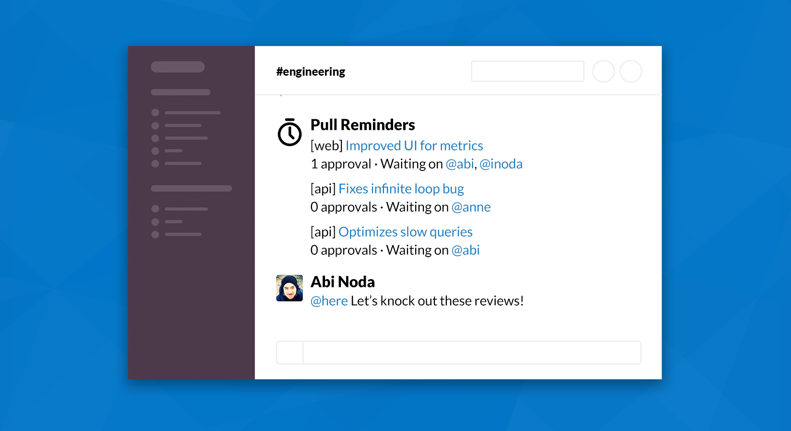

# Pull Reminders Backlog

## Overview

Backed up on pull requests? Tired of bugging people for code reviews? [Pull Reminders](https://pullreminders.com/?utm_source=github&utm_medium=backlog) helps dev teams ship code faster with automated pull request reminders and metrics.

This repo contains a [public backlog](https://github.com/pullreminders/roadmap/projects/1) under the "Projects" tab where all current and future development is tracked.

## Contribute

Have a suggestion for an improvement or new feature in Pull Reminders? Please [open a new issue](https://github.com/pullreminders/backlog/issues/new).